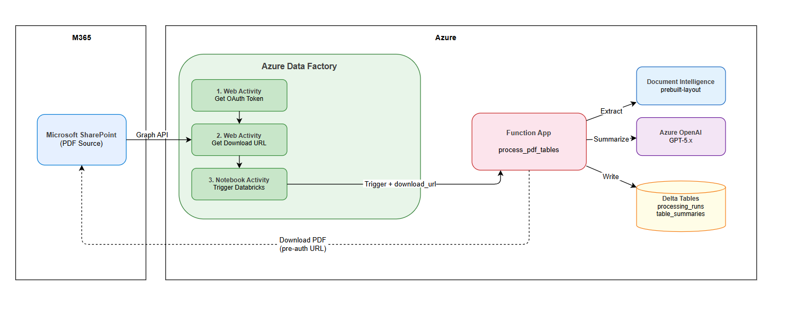

# Webhook App - PDF Table Summarizer

Azure Function App that automatically processes PDFs uploaded to SharePoint: extracts tables using Azure AI Document Intelligence, summarizes each table with Azure OpenAI GPT-4o, and writes results to Delta Tables on ADLS Gen2 -- all without requiring any Databricks compute.

## Architecture



### Key Design Decisions

- **No Databricks compute for writes**: Uses the `deltalake` Python library (delta-rs) to write Delta format directly to ADLS Gen2 storage. Databricks only reads the data via external tables.
- **Deduplication**: Checks both `processing_runs` and `table_summaries` Delta Tables before processing to prevent duplicate entries from queue retries or repeated webhook notifications.
- **Lazy imports**: All SDK imports and environment variable reads are deferred to function call time (not module level) to ensure Azure Functions host can discover and register functions reliably.
- **Deterministic pipeline**: No agentic/LLM-driven decisions about what to do; the pipeline always follows the same sequence.

## Prerequisites

### Tools

| Tool | Version | Purpose |
|------|---------|---------|
| Azure CLI (`az`) | 2.50+ | Resource management, deployment |
| Azure Functions Core Tools (`func`) | 4.x | Function App deployment |
| Python | 3.11 | Function App runtime |
| Terraform | 1.3+ | Infrastructure provisioning |

### Azure Resources (provisioned by Terraform)

| Resource | Name | Purpose |
|----------|------|---------|
| Resource Group | `rg-pdftblsum` | Contains all resources |
| Function App | `func-pdftblsum` | Hosts webhook + processing functions |
| Storage Account | `<your-storage-account>` | Function runtime, queues, optional blob output |
| ADLS Gen2 Account | `<your-adls-account>` | Delta Tables (HNS enabled) |
| AI Services | `pdftblsum-ai-services` | GPT-4o model deployment |
| Document Intelligence | `pdftblsum-doc-intel` | Table extraction (Central India) |
| Key Vault | `kv-pdftblsum` | Secrets storage |
| Application Insights | `appi-pdftblsum` | Monitoring and logging |

### Authentication & RBAC

All service-to-service authentication uses **Azure AD (Entra ID)** with Managed Identity -- no API keys or PATs.

#### Function App Managed Identity Roles

| Target Resource | RBAC Role | Purpose |
|----------------|-----------|---------|
| ADLS Gen2 (`<your-adls-account>`) | Storage Blob Data Contributor | Read/write Delta Tables |
| Blob Storage (`<your-storage-account>`) | Storage Blob Data Contributor | Read/write queues, blobs |
| AI Services (`pdftblsum-ai-services`) | Cognitive Services User | GPT-4o summarization |
| Document Intelligence (`pdftblsum-doc-intel`) | Cognitive Services User | Table extraction |
| Key Vault (`kv-pdftblsum`) | Key Vault Secrets User | Read Graph client secret |

#### Entra ID App Registration

Required for Microsoft Graph API access to SharePoint:

| Setting | Value |
|---------|-------|
| API Permission | `Sites.ReadWrite.All` (Application, admin-consented) |
| Client Secret | Stored in Function App settings (or Key Vault) |
| Service Principal | Needs `Storage Blob Data Contributor` on ADLS Gen2 if used for Unity Catalog credential |

#### Databricks (for querying results)

| Requirement | Purpose |
|-------------|---------|
| Storage Credential | Service principal or managed identity access to ADLS Gen2 |
| External Location | Points to `abfss://delta-tables@<your-adls-account>.dfs.core.windows.net/` |
| External Tables | Registered in catalog via `register_delta_tables.sh` |

## Deployment Steps

### Step 1: Deploy Infrastructure with Terraform

```bash
cd terraform
cp terraform.tfvars.example terraform.tfvars
# Edit terraform.tfvars with your actual values
terraform init
terraform apply
```

This provisions: Resource Group, Function App (Flex Consumption), Storage Account, ADLS Gen2 Account (HNS enabled), AI Services + GPT-4o deployment, Document Intelligence, Key Vault, Application Insights, and all RBAC role assignments.

After apply, note the outputs:

```bash
terraform output
# function_app_name           = "func-pdftblsum"
# delta_storage_account_name  = "<your-adls-account>"
# delta_tables_base_path      = "abfss://delta-tables@<your-adls-account>.dfs.core.windows.net/pdf_summarizer"
# function_app_url            = "https://func-pdftblsum.azurewebsites.net"
```

### Step 2: Setup IAM Roles

Wait 2 minutes after Terraform, then set env vars and run:

```bash
export RESOURCE_GROUP="rg-pdftblsum"
export FUNC_APP_NAME="func-pdftblsum"
export STORAGE_ACCOUNT="stpdftblsum"
export DELTA_STORAGE_ACCOUNT="pdftblsumdelta"
export AI_SERVICES_NAME="pdftblsum-ai-services"
export DOC_INTEL_NAME="pdftblsum-doc-intel"
export KEY_VAULT_NAME="kv-pdftblsum"

./scripts/setup_iam.sh
```

This grants:
- Storage Blob Data Contributor on ADLS Gen2
- Storage Blob Data Contributor on Blob Storage
- Cognitive Services User on AI Services
- Cognitive Services User on Document Intelligence
- Key Vault Secrets User on Key Vault

Wait 2-5 minutes after this step for Azure RBAC propagation before proceeding.

### Step 3: Deploy Function App

Install Azure Functions Core Tools if not already installed:

```bash
# On Fedora/RHEL
sudo dnf install -y nodejs npm libicu
npm install -g azure-functions-core-tools@4 --unsafe-perm true

# On Ubuntu/Debian
# sudo apt-get install azure-functions-core-tools-4
```

Deploy the code:

```bash
cd webhook-app
func azure functionapp publish func-pdftblsum --python
```

Verify both functions are registered:

```
Functions in func-pdftblsum:
    process_pdf - [queueTrigger]
    webhook_handler - [httpTrigger]
```

If functions show as empty, check the [Troubleshooting](#troubleshooting) section.

### Step 4: Set Client Secret (if special chars in secret)

If Terraform didn't set the secret correctly (special characters like `~` can be mangled by shell expansion), set it directly:

```bash
az functionapp config appsettings set \
  -g rg-pdftblsum -n func-pdftblsum \
  --settings 'GRAPH_CLIENT_SECRET=<your-secret>'
```

### Step 5: Restart Function App

Required after first deploy and after changing app settings:

```bash
az functionapp restart -g rg-pdftblsum -n func-pdftblsum
```

### Step 6: Register SharePoint Webhook

Set all required env vars and run the registration script:

```bash
export GRAPH_TENANT_ID="<your-tenant-id>"
export GRAPH_CLIENT_ID="<your-client-id>"
export GRAPH_CLIENT_SECRET='<your-secret>'
export SHAREPOINT_SITE_ID="<your-site-id>"
export WEBHOOK_CLIENT_STATE="pdf-table-summarizer"

./scripts/register_webhook.sh
```

Expected output:

```
> Getting Graph API token...
  Token acquired
> Finding document library...
  Found: Documents (ID: ...)
> Getting Function App key...
  Webhook URL ready
> Registering webhook subscription...
  Subscription created!
  ID:      <subscription-id>
  Expires: <date ~30 days from now>
```

SharePoint webhook subscriptions expire every 30 days. Set a calendar reminder to re-run this script before expiration.

### Step 7: Smoke Test

Skip the webhook and test the processing pipeline directly by sending a queue message:

```bash
az storage message put \
  --queue-name pdf-processing \
  --content '{"siteId":"<your-site-id>","filePath":"<filename>.pdf"}' \
  --account-name stpdftblsum
```

**Important:** Keep the JSON on a single line to avoid control character issues.

### Step 8 (Optional): Databricks Setup

Only needed if you want to query the Delta Tables from Databricks.

```bash
export DATABRICKS_HOST="<your-databricks-host>"
export DATABRICKS_TOKEN="<your-pat>"
export DELTA_STORAGE_ACCOUNT="pdftblsumdelta"

# Create storage credential + external location
./scripts/setup_unity_catalog.sh \
  --client-id <your-client-id> \
  --client-secret '<your-secret>' \
  --tenant-id <your-tenant-id>

# Register tables
./scripts/register_delta_tables.sh --catalog <your-catalog>
```

### Deployment Summary

| Step | Script/Command | What it does |
|------|---------------|--------------|
| 1 | `terraform apply` | Creates all Azure resources and RBAC |
| 2 | `./scripts/setup_iam.sh` | Assigns MI roles (wait 2-5 min after) |
| 3 | `func azure functionapp publish` | Deploys Function App code |
| 4 | `az functionapp config appsettings set` | Sets Graph client secret (if needed) |
| 5 | `az functionapp restart` | Loads new settings |
| 6 | `./scripts/register_webhook.sh` | Registers SharePoint webhook (renew every 30 days) |
| 7 | `az storage message put` | Smoke test via queue message |
| 8a | `./scripts/setup_unity_catalog.sh` | Creates Databricks storage credential + location (optional) |
| 8b | `./scripts/register_delta_tables.sh` | Registers external tables in Databricks (optional) |

## Testing

### Smoke Test (Queue a PDF directly)

Skip the webhook and test the processing pipeline directly by sending a queue message:

```bash
# Clear any old messages
az storage message clear --queue-name pdf-processing --account-name <your-storage-account>

# Send a test message (ensure the PDF exists in SharePoint)
# IMPORTANT: keep the JSON on a single line to avoid control character issues
az storage message put \
  --queue-name pdf-processing \
  --content '{"siteId":"<your-sharepoint-site-id>","filePath":"sample-tables.pdf"}' \
  --account-name <your-storage-account>
```

### Monitor Execution

```bash
# Live logs (requires func CLI)
func azure functionapp logstream func-pdftblsum

# Or via Azure CLI
az monitor app-insights events show \
  --app appi-pdftblsum -g rg-pdftblsum \
  --event-type traces --top 20
```

### Verify Delta Tables on ADLS Gen2

```bash
az storage fs directory list \
  -f delta-tables --path pdf_summarizer \
  --account-name <your-adls-account> --auth-mode login -o table
```

### Query in Databricks SQL

```sql
SELECT * FROM <catalog>.pdf_summarizer.processing_runs ORDER BY processed_at DESC;
SELECT * FROM <catalog>.pdf_summarizer.table_summaries ORDER BY processed_at DESC;
```

### Full End-to-End Test (via Webhook)

1. Upload a PDF to the SharePoint document library
2. Wait 30-60 seconds for the webhook notification
3. Check logs: `func azure functionapp logstream func-pdftblsum`
4. Verify results in Databricks SQL or ADLS Gen2

Expected log flow:
```
Received 1 webhook notification(s)
Enqueued PDF for processing: <filename>.pdf
Processing PDF: <filename>.pdf from site <site-id>
Downloaded <N> bytes
Extracted <N> table(s) from <filename>.pdf
Summarized <N> table(s)
Delta: wrote processing run for <filename>.pdf (succeeded)
Delta: wrote <N> table summary(ies) for <filename>.pdf
Pipeline complete for <filename>.pdf: <N> table(s) processed
```

## Troubleshooting

| Symptom | Cause | Fix |
|---------|-------|-----|
| `Functions in func-pdftblsum:` (empty list) | Module import fails at startup | All SDK imports must be inside function bodies, not at module level. Check for `ModuleNotFoundError` in deployment logs |
| `AADSTS7000215: Invalid client secret` | Secret has special characters (`~`) mangled by shell | Set secret directly: `az functionapp config appsettings set --settings 'GRAPH_CLIENT_SECRET=<value>'` |
| `Invalid control character` JSON error | Queue message split across lines | Ensure the `az storage message put --content` JSON is on a single line |
| `404 Not Found` on SharePoint file | Wrong file path in queue message | Files at drive root use just the filename (e.g., `sample.pdf`, not `Shared Documents/sample.pdf`) |
| `blob.core.windows.net` timeout | delta-rs using blob endpoint instead of DFS | Ensure `use_azure_storage_dfs_endpoint: "true"` is set in storage options |
| `403 Forbidden` on ADLS Gen2 | RBAC not propagated yet | Wait 5 minutes after `./scripts/setup_iam.sh`, then restart Function App |
| Duplicate entries in Delta Tables | Queue retry after partial success | Deduplication is built in -- redeploy latest code |

## Code Structure

```
webhook-app/
  function_app.py              # Entry point - registers webhook_handler and process_pdf
  host.json                    # Azure Functions runtime configuration
  requirements.txt             # Python dependencies
  local.settings.json          # Local development settings (placeholder values)
  functions/
    webhook_handler.py         # HTTP trigger: validates webhook, resolves changed PDFs,
                               #   enqueues processing messages
    process_pdf.py             # Queue trigger: orchestrates the full pipeline with
                               #   deduplication check
    sharepoint_client.py       # Microsoft Graph API client for downloading PDFs
    table_extractor.py         # Azure AI Document Intelligence (prebuilt-layout)
    summarizer.py              # Azure OpenAI GPT-4o table summarization
    delta_writer.py            # Writes results to Delta Tables on ADLS Gen2 using
                               #   deltalake library (no Databricks compute needed)
    blob_store.py              # Optional: writes JSON results to Azure Blob Storage
```

## Environment Variables

| Variable | Required | Description |
|----------|----------|-------------|
| `AzureWebJobsStorage` | Yes | Storage connection string for Function runtime and queues |
| `GRAPH_TENANT_ID` | Yes | Entra ID tenant ID |
| `GRAPH_CLIENT_ID` | Yes | App registration client ID |
| `GRAPH_CLIENT_SECRET` | Yes | App registration client secret |
| `DOC_INTEL_ENDPOINT` | Yes | Document Intelligence endpoint URL |
| `AI_SERVICES_ENDPOINT` | Yes | Azure AI Services endpoint URL |
| `OPENAI_MODEL` | No | Model name (default: `gpt-4o`) |
| `DELTA_STORAGE_ACCOUNT_NAME` | Yes | ADLS Gen2 storage account name |
| `DELTA_CONTAINER_NAME` | No | ADLS container for Delta Tables (default: `delta-tables`) |
| `SHAREPOINT_SITE_ID` | Yes | SharePoint site ID for webhook file resolution |
| `ENABLE_BLOB_OUTPUT` | No | Set to `true` to also write JSON to Blob Storage |
| `SUMMARIES_CONTAINER` | No | Blob container name (default: `summaries`) |
| `SUMMARIES_STORAGE_CONNECTION_STR` | No | Storage connection string for blob output |

## Delta Table Schemas

### processing_runs

One row per PDF processed.

| Column | Type | Description |
|--------|------|-------------|
| file_name | STRING | PDF file name |
| site_id | STRING | SharePoint site ID |
| processed_at | TIMESTAMP | When the file was processed |
| table_count | INT | Number of tables extracted |
| status | STRING | `succeeded` or `failed` |
| error_message | STRING | Error details if failed |

### table_summaries

One row per extracted table.

| Column | Type | Description |
|--------|------|-------------|
| file_name | STRING | PDF file name |
| table_index | INT | 1-based table index in the document |
| page | INT | Page number where table was found |
| row_count | INT | Number of rows |
| column_count | INT | Number of columns |
| markdown | STRING | Table content as Markdown |
| summary | STRING | GPT-4o generated summary |
| processed_at | TIMESTAMP | When the table was processed |
